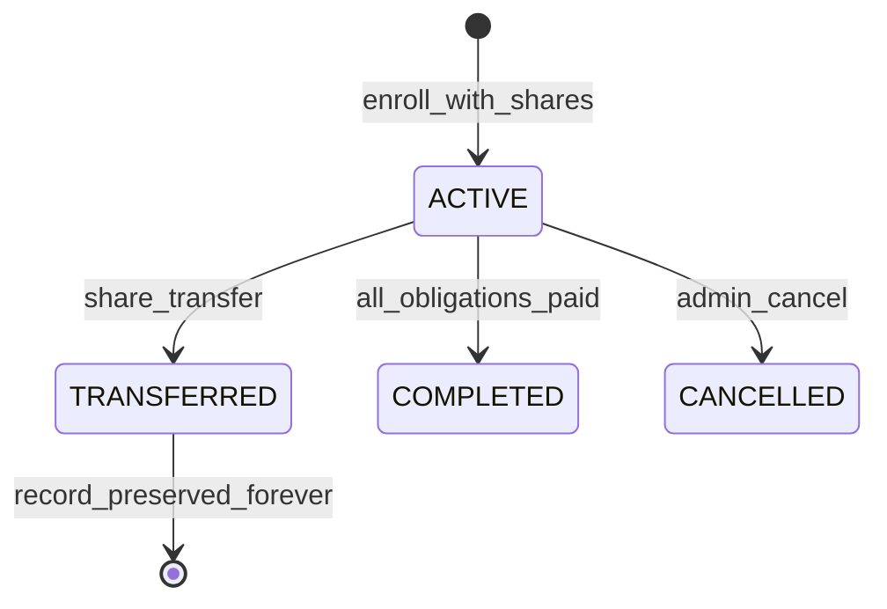

# Architecture Decision Records — Raudha Properties ERP

Ground-truth reference for architectural decisions in the Raudha Properties ERP system.

## ADR-001: SQLite Dev / PostgreSQL Prod

**Decision:** Use SQLite for local development; switch to PostgreSQL in production via `DATABASE_URL` and Prisma provider change.

**Rationale:** Fast local prototyping with zero infrastructure; production-grade relational DB for scale.

---

## ADR-002: Atomic Customer IDs via `ProjectSerialCounter`

**Decision:** Customer tracking IDs follow `[PREFIX]-[YEAR]-[SERIAL]` (e.g. `GVR-2026-001`), generated inside a Prisma transaction with upsert on `ProjectSerialCounter`.

**Rationale:** Prevents race conditions; never use `COUNT(*)` for serial generation.

---

## ADR-003: PaymentPurpose Multi-Row Ledger

**Decision:** Every payment is a `PaymentLedger` row with a required `PaymentPurpose` enum. Installment rows have `installmentIndex`; other purposes create rows on-demand.

**Categories:** `DOWNPAYMENT`, `INSTALLMENT`, `UTILITIES`, `SAND_FILLING`, `DOCUMENT_VERIFICATION`, `MISCELLANEOUS`, `FULL_SETTLEMENT` (receipt only).

---

## ADR-004: CustomerShare Junction + shareCount

**Decision:** Many-to-many via `CustomerShare` with frozen `unitPrice` per share. `Customer.shareCount` is denormalized and synced on allocation/transfer.

---

## ADR-005: Per-Project installmentMonths

**Decision:** `Project.installmentMonths` configures ledger bootstrap (GVR = 48). Not hardcoded globally.

---

## ADR-006: Phase Pricing + Twin-Combo

**Decision:** Default pricing from `Project.pricingPhases` JSON. 2+ shares apply twin-combo per-share rate (ported from marketing site `sharePricing.ts`).

---

## ADR-007: Zero-Fine Shariah Policy

**Decision:** No `lateFee`, `interestRate`, or `penaltyAmount` fields. `OVERDUE` is a status label only — never modifies `amountDue`.

---

## ADR-008: Grace Period Model

**Decision:** `graceStatus` / `isPaused` on Customer and PaymentLedger allow admin pause/recalc without mutating frozen historical rows.

---

## ADR-009: Share Transfer Exit/Entry Engine

**Decision:** Atomic transaction:
1. Customer A → `TRANSFERRED`
2. All A ledger rows → `isFrozen: true`
3. Create Customer B (successor) with new tracking ID
4. Clone pending installments > cutoff to B
5. `ShareTransferLog` + audit entry

Records are **never deleted**.



---

## ADR-010: Immutable Receipts

**Decision:** Global `receiptSlNo` via `ReceiptCounter`. HMAC-SHA256 `signatureAnchor` on receipt payload. PDF stored in `storage/receipts/`.

---

## ADR-011: NextAuth v5 RBAC

| Role | Access |
|------|--------|
| SUPER_ADMIN | Full access |
| MANAGER | Create/update customers, payments, transfers |
| AUDITOR | Read-only (middleware blocks POST/PATCH/DELETE) |

---

## ADR-012: ID Prefix Filtering

**Decision:** Customer matrix filters via `trackingId.startsWith(prefix)` — typing `GVR` isolates Green Valley customers.

---

## ADR-013: Feature-Oriented Structure

```
src/features/<feature>/{components,hooks,api,types,utils}
src/lib/services/     # Business logic
src/app/api/          # Thin route handlers
```

---

## ADR-014: Website Constants Port

Marketing site (`/Synesis/Roudha`) constants ported to `src/lib/constants/` for seed data, pricing, and receipt branding.

---

## ADR-015: Full Settlement Batch

**Decision:** `PaymentSettlement` closes all PENDING contract rows in one transaction. One consolidated receipt with `FULL_SETTLEMENT` purpose.

---

## ADR-016: Contract vs Optional Fees in Settlement

**Decision:** Default settlement covers `DOWNPAYMENT` + `INSTALLMENT` only. `includeOptionalFees` flag adds utilities/sand-filling/etc.

---

## ADR-017: Custom Pricing Hierarchy

1. `CustomerShare.unitPrice` (frozen at enrollment)
2. `CustomerContract` custom override
3. Phase default + twin-combo

---

## ADR-018: Partial Payments

**Decision:** `amountPaid` accumulates on ledger row. Status → `PAID` only when `amountPaid >= amountDue`. No interest on remainder.

---

## ADR-019: AuditLog

**Decision:** Immutable `AuditLog` on all mutating service operations. Payment reversal reserved for SUPER_ADMIN (Phase 1.5).

---

## ADR-020: Due Date Engine

**Decision:** `dueDate = contractStartDate + installmentIndex months`. Scheduled/on-demand job marks `OVERDUE` (status only, no fine).

---

## ADR-021: Frozen Contract Rates

**Decision:** Price changes on `Project.pricingPhases` never retroactively alter enrolled customers. Rates frozen on `CustomerShare` at enrollment.

---

## Entity Relationship Summary

```
Project 1──* Share
Project 1──* Customer
Project 1──* CompanyExpense
Customer 1──1 CustomerContract
Customer 1──* CustomerShare *──1 Share
Customer 1──* PaymentLedger
Customer 1──* PaymentSettlement
PaymentSettlement 1──* PaymentLedger (closed rows)
PaymentLedger 1──1 MoneyReceipt
Customer 1──* ShareTransferLog (from/to)
User 1──* CompanyExpense (recordedBy)
```

---

## ADR-022: Company Expense Module

**Decision:** All company running costs are stored in `CompanyExpense`, logically separated from customer `PaymentLedger` inflows.

**Categories:** `PRE_OPERATIONAL_LEGAL`, `OFFICE_OPERATIONS`, `BRANDING_MARKETING`, `HR_CONSULTANCY`.

**Fields:** `voucherNo` (unique), `amount`, `expenseDate`, `approvedBy` (`ADMIN` | `MANIK`), `isProjectExpense`, optional `projectId`.

**Rules:**
- Project-tagged expenses **must** link to a `Project`.
- Overhead expenses **must not** link to a project.
- Customer downpayments/installments never mix with `CompanyExpense`.

---

## ADR-023: Net Liquidity Formula

**Decision:** Executive dashboard computes:

```
Net Liquidity = Total Inflow − Total Project Costs − Total Company Overhead
```

Where:
- **Total Inflow** = sum of all `PaymentLedger.amountPaid` with status `PAID`
- **Total Project Costs** = sum of `Project.companyPaidAmount` (land/vendor) + project-tagged `CompanyExpense`
- **Total Company Overhead** = non-project `CompanyExpense`

---

## ADR-024: PDF Money Receipts

**Decision:** Receipts are rendered server-side via `@react-pdf/renderer` as `.pdf` files in `storage/receipts/`. Amounts display in English and Bengali digit grouping. HMAC `signatureAnchor` printed for verification.

---

## ADR-025: Document Vault

**Decision:** `Document` stores SHA-256 hash, optional `isPublic` for portal, `isSoftLocked` for verified/locked deeds. Files live under `storage/documents/{scope}/`.

---

## ADR-026: Grace Period Controls

**Decision:** Admin can pause a customer (`isPaused` + `graceStatus: PAUSED`). `markOverdueLedgers` skips paused customers and ledger rows in grace. No late fees are ever applied.
